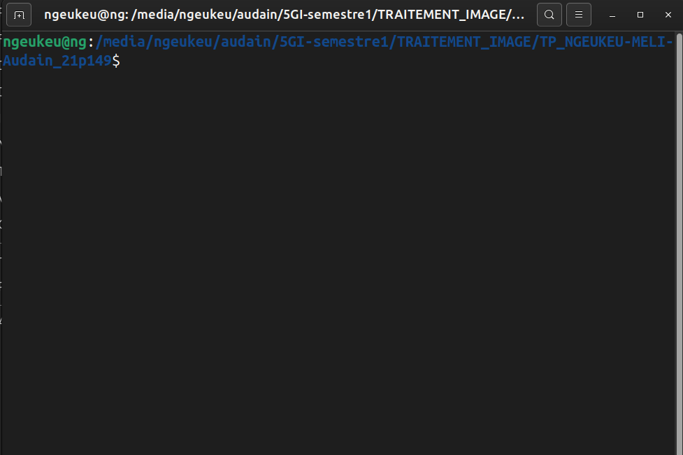
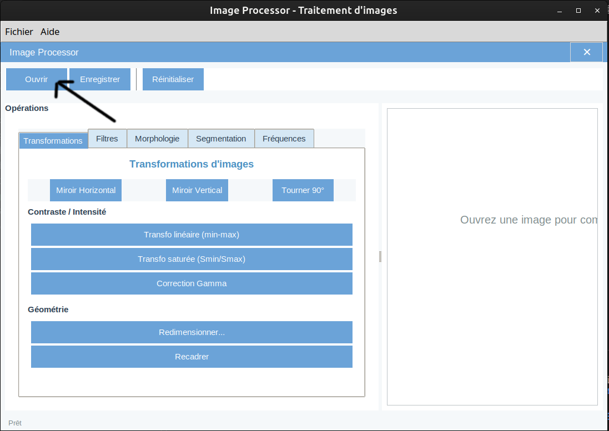
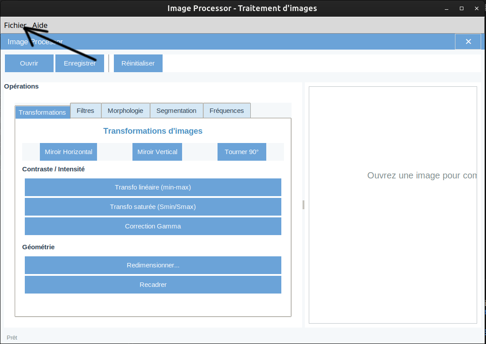
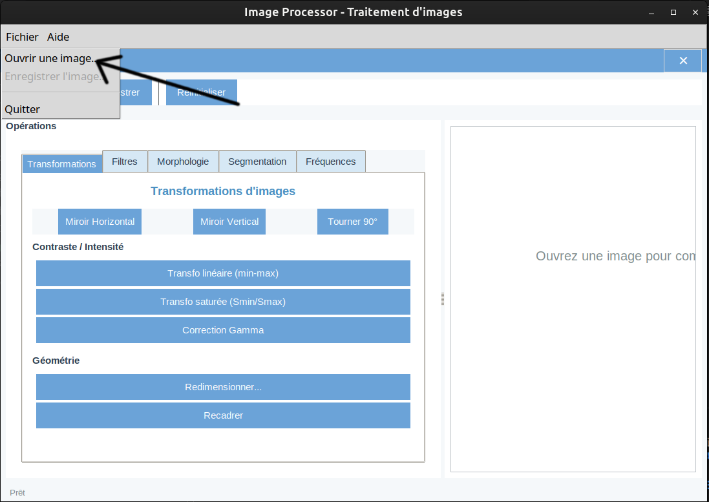
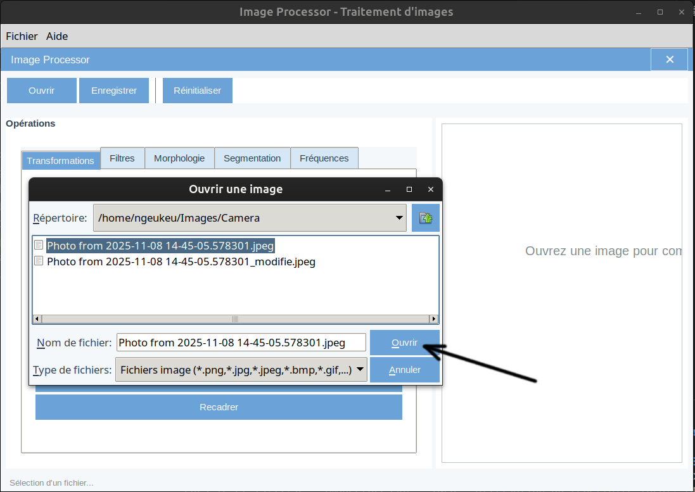
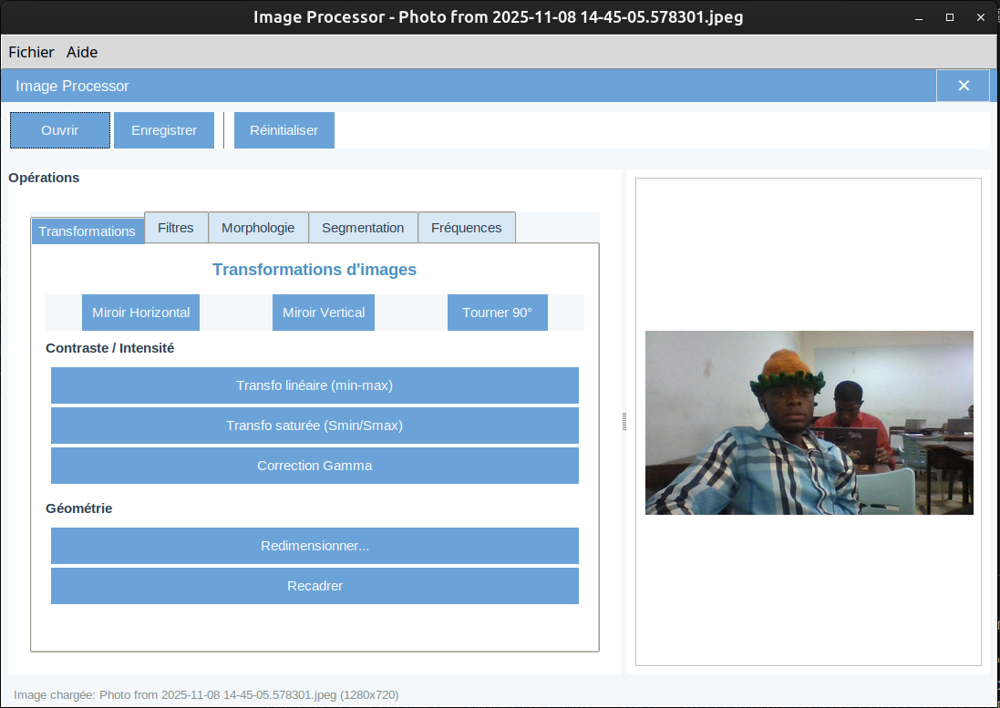

# Guide de Test - Image Processor

Guide simple pour tester l'application Image Processor, même sans connaissances techniques.

---

## 📋 Table des matières

1. [Prérequis](#prérequis)
2. [Installation](#installation)
3. [Lancement de l'application](#lancement-de-lapplication)
4. [Chargement d'une image](#chargement-dune-image)
5. [Test des fonctionnalités](#test-des-fonctionnalités)
6. [Sauvegarde d'une image](#sauvegarde-dune-image)
7. [Dépannage](#dépannage)

---

## Prérequis

### Option 1 : Avec Docker (Recommandé - Plus simple)

- **Docker Desktop** installé sur votre ordinateur
  - Windows : [Télécharger Docker Desktop](https://www.docker.com/products/docker-desktop)
  - macOS : [Télécharger Docker Desktop](https://www.docker.com/products/docker-desktop)
  - Linux : Suivez les instructions pour votre distribution

> 💡 **Avantage** : Pas besoin d'installer Python ou d'autres outils. Docker s'occupe de tout !

### Option 2 : Installation locale

- **Python 3.11** ou supérieur installé
- Accès à un terminal/invite de commande

---

## Installation

### Méthode 1 : Avec Docker (Recommandée)

1. **Vérifier que Docker est installé**
   - Ouvrez un terminal
   - Tapez : `docker --version`
   - Si une version s'affiche, Docker est installé ✅

2. **Télécharger le projet**
   - Assurez-vous d'avoir tous les fichiers du projet dans un dossier

3. **Ouvrir un terminal dans le dossier du projet**
   - Windows : Clic droit dans le dossier → "Ouvrir dans PowerShell" ou "Ouvrir dans Terminal"
   - macOS/Linux : Ouvrir Terminal et naviguer vers le dossier avec `cd`




### Méthode 2 : Installation locale

1. **Ouvrir un terminal dans le dossier du projet**

2. **Installer les dépendances**
   ```bash
   pip install -r requirements.txt
   ```


---

## Lancement de l'application

### Méthode 1 : Avec Docker (Recommandée)

#### Sur Linux :

1. **Autoriser l'accès à l'affichage** (une seule fois par session)
   ```bash
   xhost +local:docker
   ```

2. **Lancer l'application**
   ```bash
   ./docker-run.sh
   ```
   
   Ou avec docker-compose :
   ```bash
   docker-compose up
   ```

#### Sur Windows/macOS :

1. **Lancer l'application**
   ```bash
   docker-compose up
   ```

> ⚠️ **Note pour macOS** : Vous devez avoir XQuartz installé pour l'affichage graphique.

### Méthode 2 : Installation locale

1. **Lancer l'application**
   ```bash
   python start_app.py
   ```
   
   Ou :
   ```bash
   python image_processor/main.py
   ```

2. **Attendre que la fenêtre s'ouvre**


---

## Chargement d'une image

Une fois l'application lancée, vous verrez une interface avec plusieurs boutons et onglets.

### Étape 1 : Ouvrir une image

1. **Cliquer sur le bouton "Ouvrir"** dans la barre d'outils en haut

> 📸 **Espace pour capture d'écran : Bouton Ouvrir**


OU

1. **Aller dans le menu "Fichier"** en haut à gauche
2. **Cliquer sur "Ouvrir une image..."**




### Étape 2 : Sélectionner une image

1. **Dans la fenêtre qui s'ouvre**, naviguez vers le dossier contenant vos images
2. **Sélectionnez une image** (format supporté : PNG, JPG, JPEG, BMP, TIFF, GIF)
3. **Cliquez sur "Ouvrir"** ou double-cliquez sur l'image



### Étape 3 : Vérifier le chargement

- L'image devrait apparaître dans la zone de droite de l'application
- Le nom du fichier apparaît dans la barre de titre
- La barre de statut en bas affiche : "Image chargée: [nom du fichier]"



---

## Test des fonctionnalités

L'application propose 5 catégories d'opérations organisées en onglets à gauche.

### 📐 Onglet "Transformations"

Cet onglet permet de modifier la géométrie et le contraste de l'image.

#### Test 1 : Miroir horizontal
1. Cliquer sur le bouton **"Miroir Horizontal"**
2. Observer l'image retournée horizontalement

#### Test 2 : Miroir vertical
1. Cliquer sur le bouton **"Miroir Vertical"**
2. Observer l'image retournée verticalement

#### Test 3 : Rotation de 90°
1. Cliquer sur le bouton **"Tourner 90°"**
2. Observer l'image tournée

#### Test 4 : Transformation de contraste
1. Cliquer sur **"Transfo linéaire (min-max)"**
2. Observer l'amélioration du contraste

#### Test 5 : Redimensionnement
1. Cliquer sur **"Redimensionner..."**
2. Entrer une nouvelle largeur (ex: 800)
3. Entrer une nouvelle hauteur (ex: 600)
4. Observer l'image redimensionnée


### 🎨 Onglet "Filtres"

Cet onglet propose différents filtres pour améliorer ou modifier l'apparence de l'image.

#### Test 6 : Flou gaussien
1. Cliquer sur l'onglet **"Filtres"**
2. Cliquer sur **"Flou Gaussien"**
3. Observer l'effet de flou appliqué

#### Test 7 : Détection de contours
1. Cliquer sur **"Détection de contours"**
2. Observer les contours détectés

#### Test 8 : Amélioration du contraste
1. Cliquer sur **"Améliorer le contraste"**
2. Observer l'amélioration

#### Test 9 : Égalisation d'histogramme
1. Cliquer sur **"Égaliser l'histogramme"**
2. Observer la répartition améliorée des couleurs

### 🔬 Onglet "Morphologie"

Cet onglet propose des opérations morphologiques pour modifier la structure de l'image.

#### Test 10 : Érosion
1. Cliquer sur l'onglet **"Morphologie"**
2. Cliquer sur **"Érosion"**
3. Observer l'effet d'érosion

#### Test 11 : Dilatation
1. Cliquer sur **"Dilatation"**
2. Observer l'effet de dilatation

#### Test 12 : Ajustement de la taille du noyau
1. Utiliser le **curseur "Taille du noyau"** dans la section Paramètres
2. Choisir une valeur (ex: 7x7 ou 9x9)
3. Appliquer une opération (Érosion ou Dilatation)
4. Observer la différence avec différentes tailles

### 🎯 Onglet "Segmentation"

Cet onglet propose des techniques de segmentation pour isoler des parties de l'image.

#### Test 13 : Seuillage automatique
1. Cliquer sur l'onglet **"Segmentation"**
2. Cliquer sur **"Seuillage automatique"**
3. Observer la segmentation automatique

#### Test 14 : Seuillage adaptatif
1. Cliquer sur **"Seuillage adaptatif"**
2. Observer la segmentation adaptative

#### Test 15 : Segmentation k-means
1. Cliquer sur **"Segmentation k-means"**
2. Entrer le nombre de classes (ex: 3 ou 4)
3. Observer la segmentation par couleurs

#### Test 16 : Détection de contours (Canny)
1. Cliquer sur **"Détection de contours (Canny)"**
2. Observer les contours détectés

#### Test 17 : Détection de lignes (Hough)
1. Cliquer sur **"Détection de lignes (Hough)"**
2. Observer les lignes détectées (en rouge)

### 📊 Onglet "Fréquences"

Cet onglet propose des opérations en domaine fréquentiel (FFT).

#### Test 18 : Spectre FFT
1. Cliquer sur l'onglet **"Fréquences"**
2. Cliquer sur **"FFT (spectre)"**
3. Observer le spectre de Fourier de l'image

#### Test 19 : Filtrage passe-bas
1. Cliquer sur **"Filtrage passe-bas (FFT)"**
2. Observer l'effet de lissage

#### Test 20 : Filtrage passe-haut
1. Cliquer sur **"Filtrage passe-haut (FFT)"**
2. Observer la mise en évidence des détails

---

## Sauvegarde d'une image

Après avoir appliqué des modifications à votre image :

### Étape 1 : Ouvrir le dialogue de sauvegarde

1. **Cliquer sur le bouton "Enregistrer"** dans la barre d'outils

OU

1. **Aller dans le menu "Fichier"**
2. **Cliquer sur "Enregistrer l'image..."**

### Étape 2 : Choisir l'emplacement et le nom

1. **Dans la fenêtre qui s'ouvre**, choisir où sauvegarder l'image
2. **Modifier le nom du fichier** si souhaité (par défaut : `[nom_original]_modifie.[extension]`)
3. **Choisir le format** (PNG, JPEG, etc.)
4. **Cliquer sur "Enregistrer"**

### Étape 3 : Confirmation

- Un message de confirmation devrait apparaître
- La barre de statut affiche : "Image enregistrée: [nom du fichier]"

---

## Fonctionnalités supplémentaires

### Réinitialiser l'image

Si vous voulez revenir à l'image originale après plusieurs modifications :

1. **Cliquer sur le bouton "Réinitialiser"** dans la barre d'outils
2. L'image revient à son état d'origine

### Barre de statut

En bas de l'application, une barre de statut affiche :
- L'état actuel de l'application
- Le nom et la taille de l'image chargée
- Les messages d'erreur éventuels

---

## Dépannage

### Problème : L'application ne se lance pas

**Avec Docker :**
- Vérifier que Docker Desktop est démarré
- Vérifier les logs : `docker-compose logs`
- Réessayer : `docker-compose down` puis `docker-compose up --build`

**Sans Docker :**
- Vérifier que Python est installé : `python --version`
- Vérifier que les dépendances sont installées : `pip list`
- Réinstaller les dépendances : `pip install -r requirements.txt`

### Problème : L'interface ne s'affiche pas (Docker)

**Linux :**
```bash
xhost +local:docker
```

**macOS :**
- Installer XQuartz : `brew install --cask xquartz`
- Redémarrer XQuartz

**Windows :**
- Utiliser WSL2 avec un serveur X (VcXsrv, Xming)

### Problème : Impossible de charger une image

- Vérifier que le format est supporté (PNG, JPG, JPEG, BMP, TIFF, GIF)
- Vérifier que le fichier n'est pas corrompu
- Essayer avec une autre image

### Problème : Impossible de sauvegarder

- Vérifier que vous avez les permissions d'écriture dans le dossier choisi
- Essayer de sauvegarder dans un autre dossier (ex: Bureau)
- Vérifier qu'il y a assez d'espace disque

### Problème : Erreur lors d'une opération

- Vérifier qu'une image est bien chargée
- Essayer de réinitialiser l'image avec le bouton "Réinitialiser"
- Recharger l'image depuis le fichier

---

## Checklist de test complète

Utilisez cette checklist pour vous assurer d'avoir testé toutes les fonctionnalités :

### Interface
- [ ] L'application se lance correctement
- [ ] Tous les boutons sont visibles
- [ ] Tous les onglets sont accessibles
- [ ] La barre de statut fonctionne

### Chargement/Sauvegarde
- [ ] Charger une image fonctionne
- [ ] Sauvegarder une image fonctionne
- [ ] Les différents formats sont supportés

### Transformations
- [ ] Miroir horizontal
- [ ] Miroir vertical
- [ ] Rotation 90°
- [ ] Redimensionnement
- [ ] Transformation de contraste
- [ ] Correction gamma

### Filtres
- [ ] Flou gaussien
- [ ] Flou médian
- [ ] Filtre moyenneur
- [ ] Détection de contours
- [ ] Renforcement des contours
- [ ] Amélioration du contraste
- [ ] Égalisation d'histogramme

### Morphologie
- [ ] Érosion
- [ ] Dilatation
- [ ] Ouverture
- [ ] Fermeture
- [ ] Gradient morphologique
- [ ] Ajustement de la taille du noyau

### Segmentation
- [ ] Seuillage automatique
- [ ] Seuillage adaptatif
- [ ] Seuillage manuel
- [ ] Seuillage multi-seuils
- [ ] Segmentation k-means
- [ ] Étiquetage de composantes
- [ ] Détection de couleurs
- [ ] Détection de contours (Canny)
- [ ] Détection de lignes (Hough)

### Fréquences
- [ ] Spectre FFT
- [ ] Filtrage passe-bas
- [ ] Filtrage passe-haut
- [ ] Rehaussement FFT

### Fonctionnalités générales
- [ ] Réinitialisation de l'image
- [ ] Gestion des erreurs
- [ ] Messages de statut

---

## Notes pour les testeurs

- **Prenez votre temps** : Testez chaque fonctionnalité une par une
- **Observez les changements** : Comparez l'image avant et après chaque opération
- **Notez les problèmes** : Si quelque chose ne fonctionne pas, notez-le avec une capture d'écran
- **Testez avec différentes images** : Essayez avec des images de différentes tailles et formats
- **N'hésitez pas à réinitialiser** : Utilisez le bouton "Réinitialiser" pour revenir à l'original

---

## Support

Si vous rencontrez des problèmes non listés dans ce guide :

1. Vérifier les logs dans le terminal
2. Vérifier la barre de statut de l'application
3. Consulter le fichier README.md pour plus de détails techniques
4. Contacter l'équipe de développement avec :
   - Description du problème
   - Capture d'écran
   - Messages d'erreur
   - Système d'exploitation utilisé

---

**Bon test ! 🎉**

